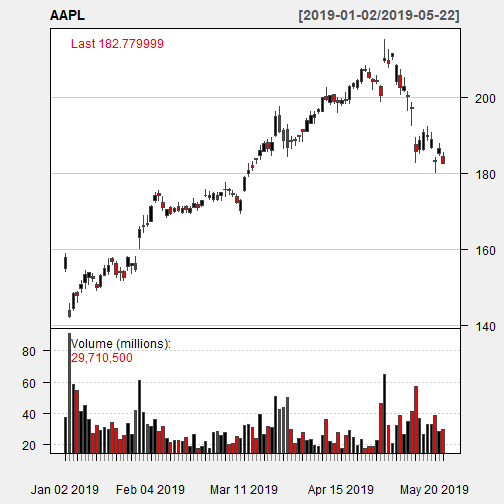
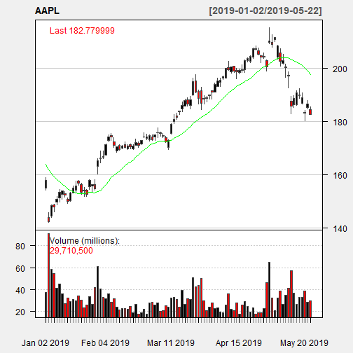
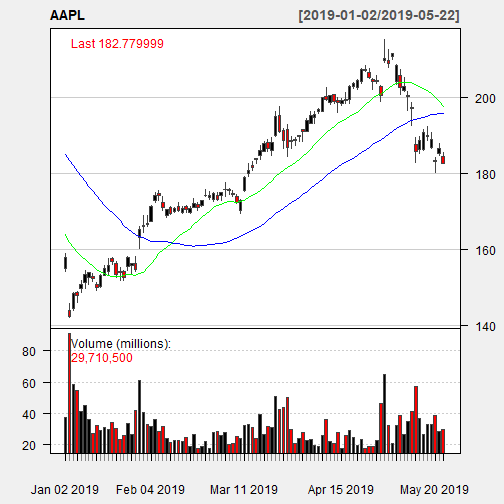

Shiny Stock Candle Chart App
========================================================
author: Dustin Lanning
date: 2019-05-23
autosize: true

Introduction
========================================================

This presentation is the final course project for the Developing
Data Products course. The project consists of two parts. First,
we are to create a Shiny app and deploy it on RStudio's servers.
Second, we must create a pitch presentation using Slidify or RStudio
Presenter.

I have chosen to create a stock chart app using the Quantmod
package. The Quantmod package allows one to develop, test and deploy
statistically based trading models. My application takes the text
input of a valid publicly traded ticker symbol and using financial
data from Yahoo, produces a candle chart of the stocks closing
price for each trading day in 2019. The user can choose to display
either a 20-day, 50-day, or 200-day simple moving average on the plot.

Quantmod getSymbols Function
========================================================

The following is an example of the getSymbols code used in my app. Apple's
ticker symbol AAPL is used for the example.


```r
library(quantmod)

getSymbols("AAPL", src = "yahoo", from = "2017-01-01")
```

```
[1] "AAPL"
```

```r
stock<-as.xts(data.frame(AAPL))

head(stock)
```

```
           AAPL.Open AAPL.High AAPL.Low AAPL.Close AAPL.Volume
2017-01-03    115.80    116.33   114.76     116.15    28781900
2017-01-04    115.85    116.51   115.75     116.02    21118100
2017-01-05    115.92    116.86   115.81     116.61    22193600
2017-01-06    116.78    118.16   116.47     117.91    31751900
2017-01-09    117.95    119.43   117.94     118.99    33561900
2017-01-10    118.77    119.38   118.30     119.11    24462100
           AAPL.Adjusted
2017-01-03      111.7098
2017-01-04      111.5848
2017-01-05      112.1522
2017-01-06      113.4025
2017-01-09      114.4412
2017-01-10      114.5567
```

Candle Chart Plot
========================================================

The following plot is an example of the candle chart produced by my app.



The App and Supporting Documentation
========================================================

The app is located at https://dlanncpa.shinyapps.io/StockCharts/.

The supporting documentation is located at https://github.com/dlanncpa/Developing_Data_Products_Week_4_Course_Project.
